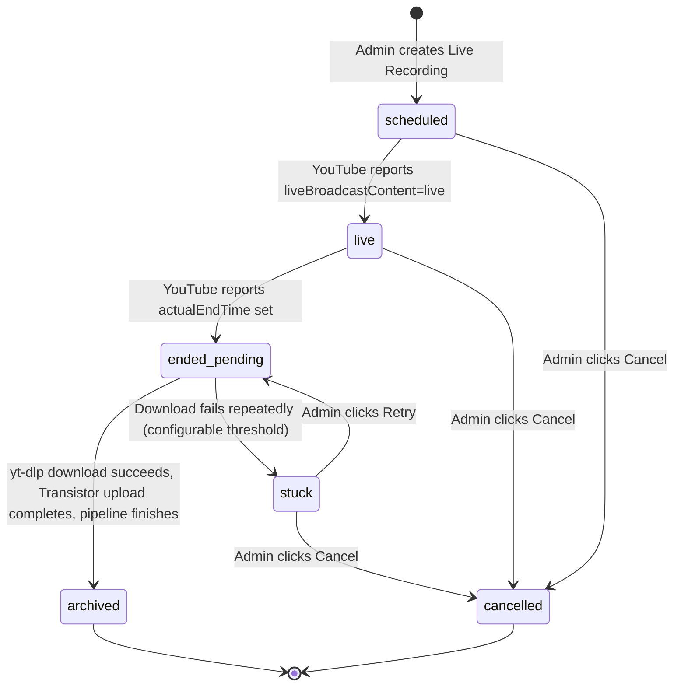
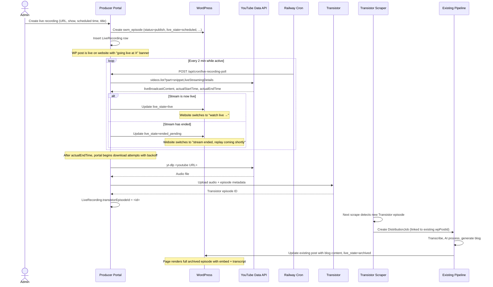

# feat: Live recording ingest workflow

## Summary

Add a new ingest path to the producer portal for live recordings broadcast via Vimeo Live → simulcast to YouTube. The same WP `swm_episode` post evolves through four states (scheduled → live → ended_pending → archived), driven by a portal-side polling cron that watches YouTube's live streaming state. When the YouTube archive becomes downloadable, the portal pulls the audio via yt-dlp, uploads it to Transistor, and hands off to the existing Transistor episode ingest pipeline for transcription, AI processing, and blog generation. The existing pipeline gets a small branch to update the already-published live-recording post in place rather than creating a duplicate.

---

## Problem Frame

The portal's current ingest model assumes Transistor is the source of truth — episodes get posted to Transistor first, the scraper picks them up, the pipeline processes them, and the portal publishes derivatives (blog post, WordPress write-through, YouTube upload). Live recordings invert that flow:

1. The broadcast happens **first** on YouTube (via Vimeo Live)
2. The portal must publish a placeholder WP post **before** the broadcast so the website can promote it
3. The portal must wait variable time (broadcast duration + YouTube VOD processing) before the audio is downloadable
4. Only **after** the YouTube archive is ready does the portal hand off to the Transistor pipeline

Volume justifies treating this as recurring infrastructure, not a pilot: Your Dark Companion (wpShowId 21) broadcasts live 2-3 times per week, and other shows are expected to adopt the same pattern. Expected steady-state: 5-15 live recordings per week across the network.

Without this work:
- Producers cannot publish a "going live at X" page through the portal
- After broadcast, the producer has to manually re-upload audio to Transistor to get the existing pipeline to run
- The WP post for a live event is created twice (once by hand for the live banner, once by the Transistor pipeline) — two URLs for one piece of content

---

## Scope Boundaries

### In scope (v1)

- New `LiveRecording` portal data model + admin UI to create one (`/dashboard/live-recordings/new`)
- Server action that publishes a `swm_episode` WP post immediately in `scheduled` state with new lifecycle meta fields
- Polling cron (`/api/cron/live-recording-poll`, every 2 minutes) that walks active recordings, calls YouTube Data API, transitions state, updates WP meta
- YouTube → Transistor handoff once the archive is downloadable
- Branch in the Transistor scraper / episode-pickup path to update the existing WP post when an incoming Transistor episode is linked to a live recording
- List/management UI at `/dashboard/live-recordings` (table of upcoming + recent past)
- Cancel action (scheduled or in-flight recordings can be cancelled and the WP post unpublished)
- Stuck/error state with admin override path
- WP coordination: documented meta keys + handoff to the website Claude for theme work

### Deferred to follow-up work

- **Recurring schedule templates** ("every Tuesday at 7 PM" → auto-create one entry/week). Worth building once the MVP is in flight and the team is creating 10+/week manually. Until then, copy-paste from the list view is acceptable friction.
- **Producer self-serve creation** — MVP is admin-only. Producers can ingest live recordings on their own once the WP-side rendering and portal-side failure modes have been proven in production. Permissions model already supports it via `UserShowAccess`; just gating the route.
- **Email/Slack notifications on state transitions**. Activity log entries cover the audit trail in v1; push notifications are nice-to-have.
- **Pre-broadcast asset prep** (e.g. uploading a custom poster image to use as the WP featured image before broadcast). For v1 the WP post uses YouTube's auto-generated thumbnail when one exists, falls back to the show's default.
- **Multi-platform simulcast** — if shows simulcast to Twitch / Facebook Live / etc., not handled here. YouTube is the only watched source.

### Outside this product's identity

- **Running the live broadcast itself** — Vimeo handles ingestion + encoding + YouTube simulcast. The portal never touches the live stream directly.
- **Social media announcements** ("we're live!" posts to X / Facebook) — separate workflow; not coupled to this plan.
- **Comment moderation on the YouTube live stream** — YouTube's own tooling owns that.

---

## Key Technical Decisions

### KTD-1. Extend `swm_episode` with new meta — don't introduce a new CPT

Live recordings and studio recordings produce the same downstream artifact: a published podcast episode with audio, transcript, and blog post. Treating them as one CPT with a `_swm_episode_source` discriminator (and lifecycle meta when `source=live`) means:
- The existing episode templates, taxonomies, and queries on the WP side still work
- The Transistor pipeline writes its output to the same post type either way
- The portal's existing episode-related data flow (DistributionJob, BlogPost, etc.) needs no new branches for "live vs. studio"

A new CPT would be cleaner separation in theory but fork every downstream surface — episode listings, RSS feeds, search, related-content blocks. Not worth it.

### KTD-2. HTTP cron endpoint with `CRON_SECRET`, not a separate Railway service

The existing `transistor-scraper` runs as its own Railway service because Playwright + browser dependencies are heavy. The live-recording poller is much lighter — pure YouTube Data API HTTP calls — and fits the same `/api/cron/*` pattern already proposed in `docs/social-media-setup.md` for the social snapshot worker.

Single endpoint protected by `Authorization: Bearer ${CRON_SECRET}`, scheduled via Railway cron at `*/2 * * * *`. Failures don't escalate (Railway shows last-run state in dashboard) — the next tick retries.

### KTD-3. Single WP post per live recording — Transistor pipeline updates in place

When the Transistor scraper pulls in the new episode (after the portal uploaded the YouTube audio), it normally creates a new WP `swm_episode` post for that episode. For live recordings we need to **suppress** that creation and instead **update** the existing post — otherwise the live-recording WP URL the audience saw during the broadcast becomes orphaned, and there's a separate "studio episode" post nobody links to.

The hook: when a `DistributionJob` is created for a Transistor episode, check whether a `LiveRecording` row exists with `transistorEpisodeId` matching the new episode. If yes, attach the job to the existing live recording's `wpPostId` and skip the WP post-create step.

### KTD-4. State machine lives in the portal; WP meta is a read-only projection

The portal owns state transitions. WP is told what state to render by the portal writing `_swm_episode_live_state` meta on every transition. The WP theme reads that meta and switches rendering; it never tries to determine state independently. This avoids split-brain (e.g., theme cron checking YouTube on its own and disagreeing with the portal).

### KTD-5. Polling every 2 minutes; only active recordings polled

Polling cadence balances UX (viewers see "live" state within ~2 min of broadcast start) against API quota. YouTube Data API costs 1 unit per `videos.list` call. Default quota is 10,000 units/day. Worst case: 15 simultaneously-active recordings × 30 polls/hr × 24 hr = 10,800 — uncomfortably close.

Mitigations baked in:
- Only recordings in `scheduled`, `live`, or `ended_pending` states are polled (archived recordings are inert)
- `scheduled` recordings are only polled within ±2 hours of `scheduledStartAt` — far-future recordings sleep
- `ended_pending` polling has exponential backoff (YouTube VOD processing can take 4-6× realtime; no reason to hit the API every 2 min for hours)

Expected steady-state poll volume: ~500-1,500/day. Plenty of headroom.

### KTD-6. Admin-only creation in v1 — producer self-serve deferred

The UI lives at `/dashboard/live-recordings/new` (gated to admin role). Producers can *view* the list of recordings for shows they have `UserShowAccess` for but can't create. This matches the existing distribution flow (admin-driven) and avoids needing to figure out producer-side error-recovery UX in the first release. Promotion to producer self-serve is one route guard change away once the operational story is proven.

### KTD-7. WP post status is `publish` from the moment of creation

The whole point of the "scheduled" state is for the website to start promoting the upcoming live event. So the WP post status is `publish` (not `draft`) from creation, and the theme renders the appropriate UI based on `_swm_episode_live_state` rather than relying on draft → publish to drive visibility.

If admin needs to retract a scheduled recording, the **Cancel** action sets WP post status to `private` (or `trash`, configurable) so it disappears from the public site without losing the data.

---

## High-Level Technical Design

*This illustrates the intended approach and is directional guidance for review, not implementation specification. The implementing agent should treat it as context, not code to reproduce.*

### State lifecycle



### Cross-system sequence (happy path)



---

## Output Structure

New and modified files in this plan:

```
prisma/
  migrations/
    <timestamp>_add_live_recordings/migration.sql
  schema.prisma                                        (modified: + LiveRecording model)

src/
  app/
    api/
      cron/
        live-recording-poll/
          route.ts                                     (new)
    dashboard/
      live-recordings/
        page.tsx                                       (list view)
        new/
          page.tsx                                     (create form)
          actions.ts                                   (createLiveRecording, cancelLiveRecording)
        [id]/
          page.tsx                                     (detail view + admin override)
          actions.ts                                   (retryStuck, forceCancel)
  components/
    forms/
      live-recording-form.tsx
    dashboard/
      live-recording-row.tsx
      live-recording-state-badge.tsx
  lib/
    live-recording/
      types.ts                                         (state enum, LiveRecordingSummary type)
      youtube-state.ts                                 (videos.list wrapper + state derivation)
      poll.ts                                          (cron handler core, dispatchable + testable)
      handoff.ts                                       (download → Transistor upload)
      __tests__/
        youtube-state.test.ts
        poll.test.ts
        handoff.test.ts
  lib/
    youtube-api.ts                                     (modified: add getVideoLiveDetails)
    jobs/
      processor.ts                                     (modified: live-recording link branch)

docs/
  live-recording-wordpress-coordination.md             (handoff to website Claude — meta schema + theme spec)
```

---

## Implementation Units

### U1. Data model: `LiveRecording` + lifecycle enum

**Goal:** Establish the portal-side table that tracks each live recording through its lifecycle. All subsequent units depend on this.

**Requirements:** Foundational — provides the row identity used by polling, handoff, and the management UI.

**Dependencies:** None.

**Files:**
- `prisma/schema.prisma` (add `LiveRecording` model)
- `prisma/migrations/<timestamp>_add_live_recordings/migration.sql`
- `src/lib/live-recording/types.ts` (state enum + helper types)
- `src/lib/live-recording/__tests__/types.test.ts`

**Approach:**

```
model LiveRecording {
  id                   String   @id @default(cuid())
  wpShowId             Int                                          // links to existing show config
  wpPostId             Int?                                         // populated after WP post creation
  youtubeVideoId       String                                       // extracted from the live URL
  youtubeLiveUrl       String                                       // canonical URL as entered by admin
  title                String
  scheduledStartAt     DateTime                                     // when admin says broadcast will begin
  state                String   @default("scheduled")               // scheduled | live | ended_pending | archived | cancelled | stuck
  transistorEpisodeId  String?                                      // populated after handoff
  actualStartedAt      DateTime?                                    // from YouTube liveStreamingDetails.actualStartTime
  actualEndedAt        DateTime?                                    // from YouTube liveStreamingDetails.actualEndTime
  archivedAt           DateTime?                                    // when pipeline finished
  lastPolledAt         DateTime?
  pollAttempts         Int      @default(0)                         // monotonic counter for backoff
  downloadAttempts     Int      @default(0)                         // separate counter for VOD download phase
  errorMessage         String?  @db.Text                            // last error if state=stuck
  createdByUserId      String
  createdAt            DateTime @default(now())
  updatedAt            DateTime @updatedAt

  createdBy User @relation(fields: [createdByUserId], references: [id])

  @@unique([youtubeVideoId])                                        // one recording per YouTube video
  @@index([state, scheduledStartAt])                                // polling worker query
  @@index([wpShowId])
  @@index([transistorEpisodeId])                                    // scraper lookup
}
```

State enum lives in `src/lib/live-recording/types.ts` as a const tuple + type predicate, mirroring the pattern from `src/lib/social/types.ts`.

**Patterns to follow:**
- `prisma/schema.prisma` existing models — cuid IDs, `@db.Text` for long strings, `@@map` snake_case (skipped here because the table name `live_recordings` is fine)
- `src/lib/social/types.ts` (state-enum + predicate pattern)

**Test scenarios:**
- Type predicate `isLiveRecordingState` accepts all six valid states and rejects unknown strings
- Helper `canTransition(from, to)` allows the valid transitions in the state diagram and rejects illegal ones (e.g., `archived → live`, `cancelled → scheduled`)
- Migration applies cleanly against a fresh DB and the resulting schema accepts a representative row

**Verification:** `npx prisma validate` passes, `npx prisma generate` produces a `LiveRecording` client type, type tests pass.

---

### U2. WordPress coordination spec — handoff doc for the website Claude

**Goal:** Produce a single coordination document at `docs/live-recording-wordpress-coordination.md` that fully specifies the meta keys, valid values, and template rendering behavior the website Claude needs to implement on the WP side. This unblocks parallel work on the WP plugin and theme without back-and-forth.

**Requirements:** Decouples the portal track from the WP track so both can ship in parallel.

**Dependencies:** None on portal code (this is documentation), but informed by U1's state set.

**Files:**
- `docs/live-recording-wordpress-coordination.md` (new)

**Approach:**

The doc covers, at minimum:

1. **New meta keys on `swm_episode`** — exact key names, value types, value sets, who writes (always the portal), who reads (the theme)
   - `_swm_episode_source` — `"live"` | `"studio"` — defaults to `"studio"` if absent
   - `_swm_episode_live_state` — `"scheduled"` | `"live"` | `"ended_pending"` | `"archived"` | `"cancelled"` | `"stuck"` — only meaningful when `source=live`
   - `_swm_episode_youtube_live_url` — the `https://www.youtube.com/watch?v=...` URL
   - `_swm_episode_youtube_video_id` — bare video ID, for templates that want to embed
   - `_swm_episode_scheduled_start` — ISO 8601 timestamp, used for the countdown
   - `_swm_episode_live_started_at` / `_swm_episode_live_ended_at` — populated after transitions
   - `_swm_live_recording_portal_id` — the portal's `LiveRecording.id` for cross-system tracing
2. **`register_meta` instructions** — these must be exposed to REST writes (`show_in_rest => true`, single value, `auth_callback` permissive for admin-with-app-password) and protected by the same `rest_after_insert_<cpt>` defensive hook added in yesterday's plugin work
3. **Template behavior by state** — what each of the four user-facing states (`scheduled`, `live`, `ended_pending`, `archived`) renders
4. **Polling behavior on the live page** — small JS that re-fetches the meta every 60 seconds while `live_state` is in `{scheduled, live, ended_pending}` and reloads/swaps DOM when state changes
5. **Cancellation handling** — when `_swm_episode_live_state = cancelled`, theme renders an explicit "this recording was cancelled" page (or 404, configurable)

**Patterns to follow:**
- `docs/social-media-setup.md` (companion-doc style, ready to hand to a different engineer/agent)

**Test scenarios:** _Test expectation: none -- pure coordination document; no behavioral surface to test._

**Verification:** Doc exists, lists every meta key the portal writes, specifies value sets, and is concrete enough that the website Claude can build against it without further questions.

---

### U3. Create Live Recording — server action + form + initial WP post

**Goal:** Admin can create a new live recording from `/dashboard/live-recordings/new` by entering URL, show, scheduled start time, title, and description. On submit, the portal extracts the YouTube video ID, creates a `LiveRecording` row, and publishes a `swm_episode` WP post in the `scheduled` state with all the meta keys from U2.

**Requirements:** First end-to-end output that the website can render.

**Dependencies:** U1, U2.

**Files:**
- `src/app/dashboard/live-recordings/new/page.tsx`
- `src/app/dashboard/live-recordings/new/actions.ts` (`createLiveRecording`)
- `src/components/forms/live-recording-form.tsx`
- `src/lib/youtube-url.ts` (modified: add `parseYouTubeLiveUrl` if not already covered)
- `src/lib/youtube-url.test.ts` (modified: add test cases for live URL parsing)
- `src/app/dashboard/live-recordings/new/__tests__/actions.test.ts`

**Approach:**
- Form fields: Show (dropdown — only shows the admin has access to, plus all shows for the admin role), YouTube URL, scheduled start (datetime-local), title, description (optional), poster image upload (optional, defers to YouTube thumbnail if absent)
- Server action validates inputs, parses the YouTube video ID, calls YouTube Data API once to confirm the video exists (so a typo in the URL fails loudly at create time), then:
  1. Creates the `LiveRecording` row
  2. Creates the WP `swm_episode` post via the existing `createPost` flow with the meta fields specified in U2 and `status: "publish"`
  3. Backfills `wpPostId` on the `LiveRecording` row
  4. Writes an `ActivityLog` entry (`action: "create"`, `contentType: "live_recording"`)
- On WP-create failure: the portal-side row is kept (so admin can retry the WP post creation from the detail view without re-entering all the fields); state stays at `scheduled` with a flag indicating the WP post hasn't been published yet (could be a separate `wpPublishStatus` field — or just `wpPostId IS NULL` works fine for v1)

**Patterns to follow:**
- `src/app/admin/blog-ideas/import/actions.ts` (server action shape, error wrapping)
- `src/components/forms/appearance-form.tsx` (controlled form fields + Select + useActionState)
- `src/lib/youtube-url.ts` (existing parser to extend)
- `src/lib/wordpress/client.ts` `createPost` (already accepts `ContentType.EPISODE` so this is purely a meta-shape question)

**Test scenarios:**
- Form rejects an empty YouTube URL with a typed error
- Server action rejects malformed YouTube URLs (e.g. a non-YouTube domain) with a clear message
- Server action rejects a video ID that doesn't resolve via YouTube Data API (404 from YT) with a clear "video not found" message
- Happy path: form submits with valid inputs → `LiveRecording` row created with state `scheduled`, WP post created with `_swm_episode_live_state="scheduled"`, `wpPostId` populated on the row
- WP-create failure path: `LiveRecording` row exists but `wpPostId IS NULL`, error is logged, admin sees actionable message on the page
- Activity log entry is created on success
- Non-admin user is redirected from the page
- The same YouTube URL cannot be submitted twice (unique constraint on `youtubeVideoId` should fail loudly; surface as a friendly "this URL is already scheduled" message)

**Verification:** Admin navigates to `/dashboard/live-recordings/new`, fills the form for a real upcoming YouTube live URL, submits, sees the new entry in the list view, and the corresponding WP post is published with the correct meta (verifiable via WP REST `?context=edit`).

---

### U4. YouTube Live state detection + polling cron

**Goal:** New endpoint `/api/cron/live-recording-poll` walks active recordings, queries the YouTube Data API for each, derives the current state, and pushes transitions to both the portal DB and the WP post meta.

**Requirements:** Drives the state machine for every recording end-to-end.

**Dependencies:** U1, U2, U3.

**Files:**
- `src/app/api/cron/live-recording-poll/route.ts`
- `src/lib/youtube-api.ts` (modified: add `getVideoLiveDetails(videoId)`)
- `src/lib/live-recording/youtube-state.ts` (pure derivation: YT API response → portal state transition)
- `src/lib/live-recording/poll.ts` (the worker logic, exported separately from the route for testability)
- `src/lib/live-recording/__tests__/youtube-state.test.ts`
- `src/lib/live-recording/__tests__/poll.test.ts`
- `.env.example` (add `CRON_SECRET` if not already present from prior plans)

**Approach:**
- `getVideoLiveDetails(videoId)` → wraps `videos.list?part=snippet,liveStreamingDetails&id=<id>` returning `{ liveBroadcastContent, scheduledStartTime, actualStartTime, actualEndTime, thumbnailUrl }`
- `deriveState(currentState, ytDetails)` → pure function that takes the portal's current state + the YouTube response and returns the next state (or unchanged). Encodes the full state machine. Easy to unit test.
- `poll.ts` worker:
  1. Queries `LiveRecording` rows in states `{scheduled, live, ended_pending}` with `scheduledStartAt` within polling window (±2 hours for `scheduled`, always for `live`/`ended_pending`)
  2. For each, calls `getVideoLiveDetails` using the show's existing YouTube credentials (resolved via `getYouTubeAccessToken` from `src/lib/analytics/credentials.ts`)
  3. Calls `deriveState`; if state changed, updates both the portal row AND posts the new state to WP via the REST API (`_swm_episode_live_state` + the appropriate timestamp meta field)
  4. Updates `lastPolledAt`, increments `pollAttempts`
  5. For `ended_pending` rows past the standard processing window (e.g. 30 minutes after `actualEndedAt`), triggers U5's handoff path
  6. Errors logged per-row, never abort the batch
- HTTP endpoint guarded by `Authorization: Bearer ${CRON_SECRET}` — same shape as the social-snapshot worker (per `docs/social-media-setup.md`)
- Returns JSON summary `{ totalChecked, transitions: [{id, from, to}], failures: [{id, error}], handoffsTriggered: [...] }`

**Execution note:** Build `deriveState` test-first — it's the heart of the state machine and easy to get subtly wrong (e.g., handling `scheduled → ended_pending` if the broadcast ends before the portal sees it as live, or recovering when YouTube briefly reports `liveBroadcastContent="none"` mid-stream due to API eventual consistency).

**Patterns to follow:**
- `src/lib/social/synthesis.ts` `maybeAutoSynthesize` pattern (fire-and-forget + per-item error isolation)
- The proposed `/api/cron/social-snapshot/route.ts` shape from `docs/plans/2026-05-11-001-feat-social-media-follower-analytics-plan.md`
- `src/lib/analytics/credentials.ts` `getYouTubeAccessToken` (existing OAuth token refresh logic)

**Test scenarios:**
- `deriveState`: `scheduled + liveBroadcastContent=live` → `live`
- `deriveState`: `live + actualEndTime set` → `ended_pending`
- `deriveState`: `ended_pending + actualEndTime set + 30 min elapsed` → triggers handoff (not a state change per se; an action)
- `deriveState`: `scheduled + liveBroadcastContent=none + no actualStart yet` → stays `scheduled` (broadcast hasn't begun)
- `deriveState`: `scheduled + actualStartTime and actualEndTime both set` → jumps to `ended_pending` (broadcast finished before we polled it as live)
- `deriveState`: `live + liveBroadcastContent=none + no actualEndTime` → stays `live` (treat as transient YT eventual consistency; don't bounce out)
- Polling endpoint without `CRON_SECRET` header returns 401
- Polling endpoint with malformed body returns 400
- Integration: a row in `scheduled` state with a fake `getVideoLiveDetails` returning `liveBroadcastContent=live` transitions to `live`, updates `lastPolledAt`, and posts `_swm_episode_live_state="live"` to WP (mock WP fetch)
- One row's failure (e.g. YT API 403) does not abort the rest of the batch; failure is logged with `errorMessage` on that row
- `pollAttempts` counter increments every tick regardless of transition; used downstream for stuck detection

**Verification:** Hit `/api/cron/live-recording-poll` with the secret header against a real `LiveRecording` row for a real upcoming YouTube video; on the next tick after the broadcast starts, the row's state flips to `live` and the WP post's meta reflects it.

---

### U5. YouTube → Transistor handoff (download + upload)

**Goal:** Once a recording is in `ended_pending` state past the processing window, download the audio from YouTube via yt-dlp and upload it to Transistor as a new episode. Store the resulting Transistor episode ID on the `LiveRecording` row.

**Requirements:** The handoff is what unlocks the existing pipeline to do transcription + AI + blog gen.

**Dependencies:** U1, U4. Reuses `src/lib/jobs/youtube-video-downloader.ts` (yt-dlp wrapper).

**Files:**
- `src/lib/live-recording/handoff.ts` (download + Transistor upload orchestration)
- `src/lib/live-recording/__tests__/handoff.test.ts`
- `src/lib/transistor/upload.ts` (new — Transistor audio upload via their API)
- `src/lib/transistor/__tests__/upload.test.ts`

**Approach:**
- `handoff.ts` exports `runHandoff(liveRecordingId)`:
  1. Loads the row, validates state is `ended_pending`
  2. Increments `downloadAttempts`
  3. Calls existing yt-dlp wrapper to fetch the audio (audio-only extraction, MP3 or M4A)
  4. Uploads to Transistor via their REST API (`POST /v1/episodes` with audio upload) using show's existing Transistor credentials
  5. Captures the Transistor episode ID
  6. Updates `LiveRecording.transistorEpisodeId`; state remains `ended_pending` until the scraper-driven pipeline finishes and U6 closes the loop to `archived`
  7. On download failure: if `downloadAttempts >= STUCK_THRESHOLD` (e.g., 5 consecutive failures over ~30 minutes), transition to `stuck` with error message; otherwise leave for next poll tick to retry
  8. On Transistor upload failure: same backoff logic, separate retry counter could be added if needed (probably not for v1 — failure modes are similar)
- Trigger is the poll worker (U4) calling `runHandoff` async; do not block the poll cycle on a long-running download

**Execution note:** Test-first for the failure paths. The retry-with-backoff logic is the most likely source of "stuck downloading forever" or "spammed Transistor with duplicate uploads" bugs.

**Patterns to follow:**
- `src/lib/jobs/youtube-video-downloader.ts` (existing yt-dlp invocation)
- `src/lib/analytics/credentials.ts` `getTransistorApiKey` (existing show-keyed credential resolution)

**Test scenarios:**
- Happy path: yt-dlp succeeds, Transistor upload succeeds, `transistorEpisodeId` populated
- yt-dlp fails (mocked): `downloadAttempts` increments, state stays `ended_pending` if under threshold, becomes `stuck` once threshold crossed, `errorMessage` populated
- Transistor upload fails (mocked 500): same backoff behavior
- Already-handed-off recording (transistorEpisodeId already set): `runHandoff` is idempotent, doesn't re-upload
- Recording state is not `ended_pending`: function refuses to act, returns clear error
- Live recording's show has no Transistor credentials configured: state becomes `stuck` with a credential-specific error message

**Verification:** Manually trigger `runHandoff` for a real ended live recording; observe the audio file in Transistor with the correct show association, and `LiveRecording.transistorEpisodeId` populated.

---

### U6. Existing pipeline branch — update in place when linked to a `LiveRecording`

**Goal:** When the Transistor scraper sees the new episode and the existing pipeline creates a `DistributionJob`, detect that this episode is linked to a `LiveRecording` row and update the existing `wpPostId` rather than creating a new `swm_episode` post. Final pipeline step transitions the live recording to `archived`.

**Requirements:** Single WP post per live recording — the linchpin of KTD-3.

**Dependencies:** U1, U5, plus existing pipeline code.

**Files:**
- `src/lib/jobs/processor.ts` (modified: link lookup at job creation)
- `scripts/transistor-scraper/index.ts` (modified: pass through episode ID so the link can be made)
- `src/lib/wordpress/client.ts` (no change expected; existing `updatePost` already exists)
- `src/lib/jobs/__tests__/processor-live-link.test.ts`

**Approach:**
- When the scraper detects a new Transistor episode and the pipeline creates a `DistributionJob`:
  1. Query `LiveRecording` by `transistorEpisodeId` matching the new Transistor episode's ID
  2. If a match exists: set the job's `wpShowId` and bind the job to the existing `wpPostId` instead of letting downstream code create a new post
  3. If no match: existing path runs unchanged (studio recording)
- The pipeline's final "publish to WordPress" step needs to branch: if linked to a live recording, **update** the existing post (writing transcript, blog content, AI metadata into the same post), then transition `LiveRecording.state = "archived"` + write `_swm_episode_live_state="archived"` + set `archivedAt`
- Activity log entry: `action: "archive_from_live"` so the audit trail distinguishes from a fresh episode publish

**Patterns to follow:**
- `src/app/admin/blog-ideas/blog-actions.ts` `publishToWordPress` for the WP update pattern + meta merging
- The `_swm_appearance_gallery` meta update pattern from `scripts/fix-eric-nadel-hero.ts` (combine `featured_media` + meta writes in a single REST call so the defensive hook ensures featured_media takes)

**Test scenarios:**
- Studio recording (no `LiveRecording` link): existing path runs unchanged, new `swm_episode` post created
- Live recording link found: no new WP post created; existing `wpPostId` updated with transcript/blog content
- After pipeline completes, `LiveRecording.state = "archived"`, `archivedAt` populated
- WP post's `_swm_episode_live_state` meta is `"archived"` after the pipeline finishes
- Pipeline failure mid-process (e.g. transcription fails): `LiveRecording.state` stays `ended_pending`; admin can retry the pipeline
- Activity log entries distinguish `archive_from_live` from `create`

**Verification:** End-to-end: create a live recording, broadcast (or simulate by manually updating the YouTube video to `liveBroadcastContent="none"` with `actualEndTime` set), let the poll cron + handoff + Transistor scraper + pipeline run. The original WP post URL still resolves and now shows the full episode with transcript + blog content; no second WP post exists for this content.

---

### U7. Failure handling — stuck state, cancellation, admin override

**Goal:** Recordings that get stuck (download failures, Transistor errors, broadcast cancelled without portal knowing) have a clear state, surface to admin, and can be retried or cancelled with one action.

**Requirements:** Recurring infrastructure needs operability. Without this, every failure becomes a ticket.

**Dependencies:** U1, U4, U5, U6.

**Files:**
- `src/app/dashboard/live-recordings/[id]/page.tsx` (detail view with state, error, admin actions)
- `src/app/dashboard/live-recordings/[id]/actions.ts` (`retryStuck`, `forceArchive`, `cancelLiveRecording`)
- `src/app/dashboard/live-recordings/__tests__/actions.test.ts`

**Approach:**
- Detail view shows: current state, scheduled vs actual times, YouTube embed, last poll info, last error message if stuck, Transistor episode ID if handed off, links to the WP post + Transistor episode
- Actions:
  - **Cancel** (any non-archived state) — sets `state="cancelled"`, posts `_swm_episode_live_state="cancelled"` to WP, sets WP post `status="private"` (or trash, behind a config flag). Active polling stops automatically because the worker only walks active states
  - **Retry** (only from `stuck`) — resets `downloadAttempts=0`, transitions back to `ended_pending`, fires `runHandoff` immediately
  - **Force archive** (only from `stuck` or `ended_pending`) — bypass the handoff and mark as archived; useful when the admin uploaded to Transistor manually and just wants the WP post updated
- All actions require admin role

**Patterns to follow:**
- `src/app/admin/social-accounts/actions.ts` (admin-action shape, transactional updates)

**Test scenarios:**
- Cancel from `scheduled` → state=cancelled, WP post status=private, activity log entry
- Cancel from `live` → same
- Cancel from `ended_pending` → same (and if handoff is mid-flight, it's allowed to complete but its result is ignored)
- Cancel from `archived` is disallowed (button hidden in UI; action returns error if called via API)
- Retry from `stuck` → state=ended_pending, downloadAttempts=0, handoff triggered
- Retry from any other state is disallowed
- Force archive from `stuck` → state=archived, WP meta updated, requires confirmation modal
- Detail view loads for any non-admin gives 403 (or redirect)

**Verification:** Manually break a recording (e.g., delete the YouTube video) and observe it transitioning to `stuck`; clicking Retry restarts the handoff; clicking Cancel cleanly removes the WP post from public view.

---

### U8. Live recordings list view at `/dashboard/live-recordings`

**Goal:** Single page where admins can see all upcoming, active, and recent past live recordings at a glance. Default filter: show next 7 days + last 14 days.

**Requirements:** Producers create 5-15/week — they need a list. New nav item.

**Dependencies:** U1, U3, U7.

**Files:**
- `src/app/dashboard/live-recordings/page.tsx` (list view, server component)
- `src/app/dashboard/live-recordings/list-toolbar.tsx` (filters: show, state, date range)
- `src/components/dashboard/live-recording-row.tsx`
- `src/components/dashboard/live-recording-state-badge.tsx`
- `src/components/admin-sidebar.tsx` (modified: add nav item if admin route, or `src/components/sidebar.tsx` for producer view)

**Approach:**
- Server component queries `LiveRecording` rows with default filter (upcoming + last 14 days), grouped by date
- Each row shows: state badge, show name, scheduled time, title, action buttons (View, Cancel, etc.)
- Toolbar filters: show (multi-select), state (multi-select), date range
- New nav item in `src/components/sidebar.tsx` (for producer view: read-only list of own shows' recordings) and in `src/components/admin-sidebar.tsx` (for admin: full CRUD)
- Admin sees "+ New Live Recording" button at top, linking to U3's create form

**Patterns to follow:**
- `src/app/admin/social-accounts/page.tsx` (list + grouped sections + Connect buttons)
- `src/app/admin/blog-ideas/page.tsx` (filter + grouping pattern)

**Test scenarios:**
- Page renders empty state when no recordings exist
- Page renders grouped sections for "Today", "This week", "Recent past"
- Filter by show narrows the list correctly
- Filter by state narrows the list correctly
- Producer (non-admin) sees only recordings for shows they have access to; no "+ New" button visible
- Admin sees all recordings + the new-recording button
- State badge color matches the state (green for `archived`, red for `stuck`, blue for `live`, etc.)

**Verification:** Page renders at `/dashboard/live-recordings` for admin + producer roles, filters work, links to the detail view (U7) and create page (U3).

---

## System-Wide Impact

| Surface | Impact |
|---|---|
| **Portal database** | One new table (`live_recordings`). Additive; no existing-table changes. |
| **Portal cron schedule** | One new Railway HTTP cron at `*/2 * * * *` hitting `/api/cron/live-recording-poll`. |
| **Existing pipeline (`src/lib/jobs/processor.ts`)** | Small branch at job creation + at WP-publish step. Studio recordings unaffected. |
| **Transistor scraper** | No code change strictly required; it surfaces the new episode and the pipeline takes over. (May need a small change in `scripts/transistor-scraper/index.ts` to pass the Transistor episode ID through to job creation — verify during U6.) |
| **Producer dashboard** | New section `/dashboard/live-recordings` with list + detail + create views. New sidebar nav item. |
| **WordPress theme** | New meta fields rendered; new template branches; small JS poll on the live page. Handled by website Claude per `docs/live-recording-wordpress-coordination.md`. |
| **WP `swm_episode` CPT** | New `register_meta` calls (handled WP-side). The portal-side write surface uses existing `createPost` + `updatePost`. |
| **Activity log** | New `contentType: "live_recording"` and actions `create`, `cancel`, `retry`, `archive_from_live`. |
| **Env vars** | `CRON_SECRET` (may already be planned from social-snapshot work). |
| **External services** | No new services. Uses existing YouTube Data API access, existing Transistor API integration, existing WP REST API. |

---

## Risks and Mitigation

| Risk | Likelihood | Impact | Mitigation |
|---|---|---|---|
| **YouTube API eventual consistency** — `liveBroadcastContent` value briefly flips to `none` mid-stream, would otherwise look like the stream ended | Medium | Medium — could trigger premature handoff | `deriveState` requires both `liveBroadcastContent="none"` AND `actualEndTime` to transition out of `live`. Pure `none` without `actualEndTime` is ignored as transient. |
| **YouTube VOD processing takes longer than expected** — broadcast ends, yt-dlp fails for hours waiting for archive | Medium | Low — handled by retry-with-backoff | Backoff schedule in U5; `downloadAttempts` tracked; recording goes to `stuck` only after threshold (default 5 attempts over ~30 min, configurable). |
| **WP REST `featured_media` silent rejection** — pattern observed yesterday with `swm_appearance` | Low (now) | Medium | The `rest_after_insert_<cpt>` hook from yesterday's WP plugin work covers this for `swm_episode` too. Portal-side also writes `_swm_episode_*` meta in the same payload (matches the working pattern from `scripts/fix-eric-nadel-hero.ts`). |
| **Token leakage in cron logs** — YouTube OAuth tokens or Transistor API keys end up in `console.log` output visible in Railway | Low | High (security) | Use existing credential resolution patterns (`getYouTubeAccessToken`, `getTransistorApiKey`) that already encapsulate secrets. Add an explicit code-review checklist item: no token values in log lines. |
| **YouTube API quota exhaustion** | Low at projected volume | Medium — polling stops, state transitions halt | Limit polling to active recordings + backoff for `ended_pending` (see KTD-5). If quota becomes a real concern, escalate to a separate API project for the portal. |
| **Producer creates a duplicate recording for the same YouTube URL** | Medium | Low | DB unique constraint on `youtubeVideoId`. UI surfaces a friendly error. |
| **Vimeo Live changes its YouTube simulcast URL after the recording starts** — admin entered an old URL | Low | High — recording captured to wrong post | Manual remedy via U7's Cancel + re-create. Long-term, surface YouTube channel verification at create time. |
| **Live recording happens but the producer forgets to create the portal entry beforehand** | Medium | Medium — no website promotion during broadcast | Acceptable for v1. Recording can still be ingested after-the-fact: admin enters the URL post-broadcast, portal recognizes it's already ended, skips straight to `ended_pending`, hands off to Transistor. Document this in the create form's helper text. |
| **Transistor scraper picks up the new episode and pipeline runs BEFORE the portal sets `transistorEpisodeId`** — race condition between U5's upload and U6's pickup | Medium | Medium — would create a duplicate WP post | U5 must set `transistorEpisodeId` **before** uploading to Transistor (or in the same transaction-equivalent sequence). The pipeline's link-lookup query in U6 should also recheck immediately before creating any WP post, in case timing varies. |
| **Multi-day broadcasts** (e.g., a 26-hour livestream) | Very low | Low | State machine handles arbitrary live duration. Worth noting that very long broadcasts mean very large yt-dlp downloads; ensure download attempts have appropriate timeouts. |

---

## Dependencies and Prerequisites

These must be in place before merging this plan's work to production:

1. **WordPress side (parallel track for the website Claude):** the meta fields specified in U2's coordination document must be registered (`register_meta` with `show_in_rest => true`) and the theme template must branch on `_swm_episode_live_state`. Without this, the portal writes meta the theme ignores and the public-facing rendering doesn't change. Coordinate timing: portal can ship and the WP meta-write attempts will succeed silently; the visible behavior unlocks once the theme branches land.

2. **Railway cron** — add a scheduled HTTP job at `*/2 * * * *` calling `/api/cron/live-recording-poll` with `Authorization: Bearer ${CRON_SECRET}`. Same pattern as the social-snapshot worker; coordinate with the operator who set that up.

3. **YouTube API access** — already in place via existing OAuth credentials per show. Confirm the show's existing token has sufficient scope to call `videos.list?part=liveStreamingDetails` (it should — same OAuth scope as the existing analytics calls).

4. **Transistor API access** — already in place; uses the same per-show Transistor credentials the existing pipeline uses for write-through.

5. **`yt-dlp` in the production Docker image** — already in place per the existing `Dockerfile`.

---

## Operational Notes

- **Rollout sequencing:** U1 → U2 → U3 (admin can create, WP post publishes but no state transitions yet) → U4 (state transitions live) → U8 (list UI for visibility) → U5 + U6 (handoff + pipeline integration) → U7 (failure recovery). Sequencing lets each phase be verified independently against a real broadcast.
- **First-broadcast verification:** Schedule a low-stakes Your Dark Companion live recording, manually walk through each state transition while watching Railway logs + WP page rendering. Plan for at least one full-cycle dress rehearsal before declaring the feature live.
- **Monitoring:** Each poll cycle writes a summary to `ActivityLog`. After every cron run, an admin can see `[live-recording] processed=N transitions=N failures=N` style entries. Stuck recordings show in the list view with a red badge.
- **Cost ceiling:** YouTube Data API at projected polling volume is well within free quota. Transistor upload uses existing per-show credential allowance. No new spend.
- **Cleanup of orphan downloads:** yt-dlp temporary files should be cleaned up after upload to Transistor. If Railway disk fills due to a stuck recording's repeated download attempts, ops will notice via Railway dashboard. Add explicit `unlink` of the downloaded audio after a successful upload.

---

## Deferred Implementation Questions

These should be resolved during implementation, not planning:

- **Stuck threshold tuning** — start at 5 download attempts; observe production data and tune. May want platform-aware threshold (long videos take longer to process).
- **WP post `status` on cancel** — `private` vs `trash` vs custom. Defer until first cancellation happens in production and we see whether the audience-facing behavior matters.
- **Poster image upload on create** — defer the form field. v1 falls back to YouTube's thumbnail. Implementer can add the form field in the same PR if it's a 30-min add, but not a blocker.
- **Should the create form expose the activity-log timestamp?** — i.e., can admins see "this recording will start polling at HH:MM"? Probably yes for operability, but skipping a deep design discussion.
- **Handling of broadcasts that start before `scheduledStartAt`** — the polling-window logic in U4 may miss them by up to two hours if the admin overestimated start time. May want to widen the window or detect via YouTube API even before the scheduled-window opens.
- **Whether existing studio episodes should retroactively get `_swm_episode_source="studio"` meta** — if the WP theme defaults to "studio" when meta is absent, no backfill needed. If not, write a one-off migration script.
- **Naming collision** — `LiveRecording` vs existing `DistributionJob` etc. — verify no name clashes during implementation.
